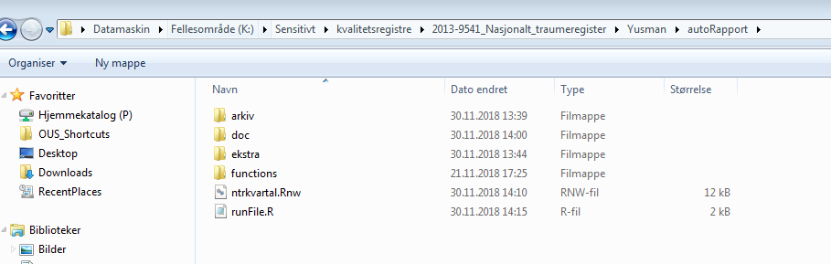
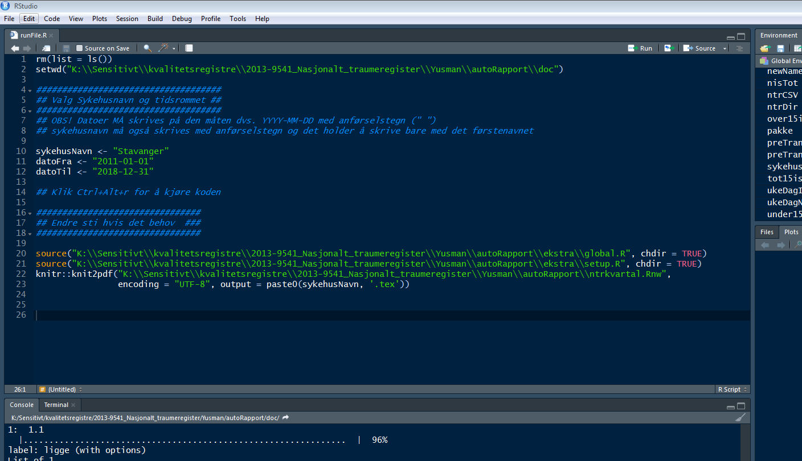
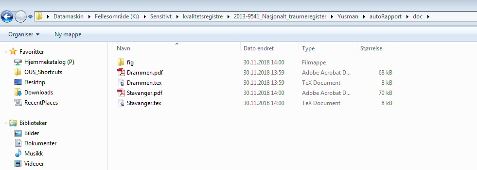

# Rapport kompilator via RStudio

Noen ganger kan det være et problem å generere rapport via Shinyapps. Hvis du har det
problemmet kan det være aktuelt å kompilere rapport via RStudio. Her finner man
veiledning for å gjøre det:

## Sti til mappen

Mappen ligger i *K sensetive* området og heter **autoRapport**. Inne denne mappen
ligger en fil som heter **runFile.R**. Denne filen som skal brukes til å kompilere
rapporten. Bildet nedenfor viser hvor mappen ligger.

## Generere rapport

Starter RStudio program og finner fram mappen **autoRapport** ved bruk av menyen som
heter *File* og deretter *Open File*. Når du har funnet rapport mappen, valg
filen **runFile.R** og deretter klikk Open*.

Det er 3 variabler som du kan endre. De er:

1. *sykehusNavn*: Valg sykehus til rapporten
2. *datoFra*: Valg startdato for rapporten
3. *datoTil*: Valg sluttdato for rapporten

Viktig at strukturen beholdes dvs. bruk av anførselstegn og måten dato skal skrives
*"YYYY-MM-DD"*. Kjør koden ved å tykke **Ctrl+Alt+r** eller ved bruk menyen *Code ->
Run Region -> Run All*. Se figuren nedenfor:

## Hvor ligger rapporten?

Når koden er kjørt, ligger ferdig rapporten i mappe som heter **doc**. I mappen
**fig** finner du figuren til ukedager.

